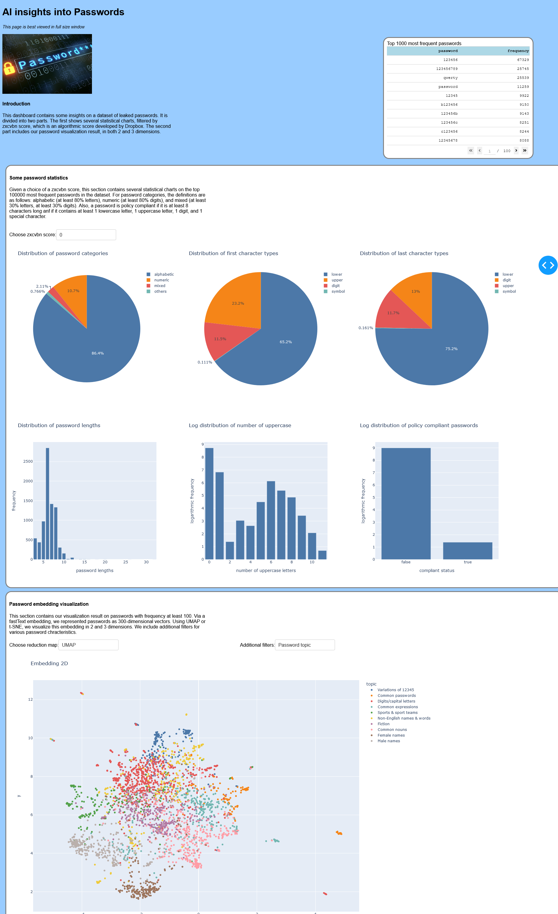

## Introduction
### Context
This project is part of the [Accelerated Cybersecurity training program](https://paletteskills.org/programs/cybersecurity-training) offered by Palette Skills and Fields Institute for Research in Mathematical Sciences. 

### Goal
Using a dataset of passwords, our goal is to create a visualization dashboard to provide insights into password properties and password topic modelling. A future goal is to study further password similarities, and conduct password strength analysis. 

## Details
### Data
During this project, I mostly worked with a dataset of leaked password containing ~7.5 million unique passwords. However, for the sake of processing time and demonstration, the current `demo` folder contains two files `demo_frame` and `demo_reduction` which contains information and features of 100000 and ~3000 unique passwords respectively. 

### Methods
To visualize passwords, we use the following [pretrained fastText word embedding](https://fasttext.cc/docs/en/pretrained-vectors.html) to represent passwords as 300-dimensional vectors. Since fastText is good at embedding rare words, it would be useful to embed passwords. 

Next, I used clustering algorithms to find groups of similar topics. The labels found in `demo_reduction` were found through k-means. It is possible to use other clustering algorithms, for example, [HDBSCAN](https://hdbscan.readthedocs.io/en/latest/index.html) can give much more fine-grained clusters. 

Then, I used dimension reduction techniques such as [t-SNE](https://en.wikipedia.org/wiki/T-distributed_stochastic_neighbor_embedding) and [UMAP](https://umap-learn.readthedocs.io/en/latest/) to visualize the password embedding in 2 and 3 dimensions. 

*Note: one can also use [another](https://fasttext.cc/docs/en/crawl-vectors.html) pretrained fastText embedding.*

### Visualization dashboard

To create a visualization dashboard, we use [the Dash framework](https://dash.plotly.com/). One can find several statistical charts, and the password visualization result. We can find more additional information in `dashapp/README.md`. Here we have a screenshot of the demo Dash app.

### Notebooks
I recorded some of my approaches and analysis in `Notebooks`. Note that these are quite unrefined still. There are some good information there, but can be a little hard to read.  